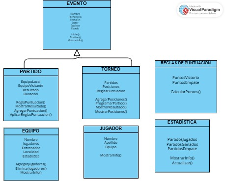

### TALLER DE LENGUAJE DE PROGRAMACIÓN IV

**Integrantes del proyecto** :
* Fleitas Ezequiel
* Miño Ailin
* Medina Tatiana


## Cómo ejecutar el programa: 
 * Dirigirse a la carpeta raíz
 * Ejecutar el comando para correr el archivo app.js

 ```bash
 node app.js
 ```


## Primer diagrama


## Diagrama de Clases Final
 


## Funcionalidades
1. **Creación de Equipos**: Permite crear equipos y asignarles un nombre y un director.
2. **Visualización de Equipos**: Permite ver los equipos creados anteriormente.
3. **Simulación de partidos**: Permite disputar un partido entre 2 equipos previamente creados, indicando el resultado del partido.
4. **Creación de Eventos**: Permite crear eventos deportivos con nombre, fechas y estado.
