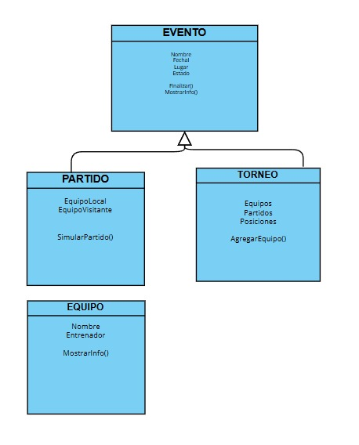

### TALLER DE LENGUAJE DE PROGRAMACIÓN IV

## Cómo ejecutar el programa: 
 * Dirigirse a la carpeta raíz
 * Ejecutar el comando para correr el archivo todo.js

 ```bash
 node todo.js
 ```

## Funcionalidades
1. **Creación de Equipos**: Permite crear equipos y asignarles un nombre y un director.
2. **Visualización de Equipos**: Permite ver los equipos creados anteriormente.
3. **Simulación de partidos**: Permite disputar un partido entre 2 equipos previamente creados, indicando el resultado del partido.

## Diagrama de Clases
 
